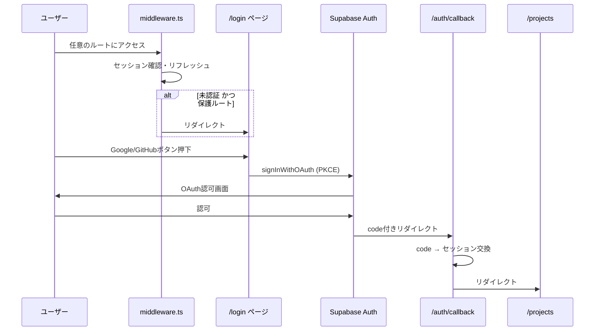

# Supabase Auth によるGoogle/GitHub認証の実装

## 現状分析

- `profiles` テーブルは既に `auth.users` を参照して設計済み（RLSポリシーも `authenticated` ロールで設定済み）
- `.env` にGoogle/GitHub OAuth のClient ID/Secretが設定済み
- Supabaseダッシュボードでプロバイダー設定済み
- `@supabase/ssr` パッケージは未導入
- `middleware.ts` は未作成
- 認証用のContext/Providerは未実装
- `profiles` テーブルへの自動INSERT トリガー（`handle_new_user`）が未作成

## アーキテクチャ



## 実装内容

### 1. パッケージ追加

`@supabase/ssr` をインストールする。Next.js App Router での Cookie ベースのセッション管理に必要。

### 2. Supabase クライアントユーティリティの再構成

現在の [`src/lib/supabase.ts`](src/lib/supabase.ts) を拡張し、以下の3種類のクライアントを用意する:

- **ブラウザクライアント** (`createBrowserClient`): クライアントコンポーネント用。Cookie ベースのセッション管理
- **サーバークライアント** (`createServerClient`): Server Components / Route Handlers / Server Actions 用。`cookies()` からセッションを読み取る
- **ミドルウェアクライアント** (`createMiddlewareClient`): `middleware.ts` 用。セッションリフレッシュとCookie書き込み

既存の `createServiceClient()` はBFF用として維持する。

### 3. ミドルウェア作成

[`src/middleware.ts`](src/middleware.ts) を新規作成:

- 全リクエストでセッショントークンをリフレッシュ（Supabase Auth の推奨パターン）
- 未認証ユーザーを `/login` にリダイレクト
- 認証済みユーザーが `/login` にアクセスした場合は `/projects` にリダイレクト
- 静的アセット、API Routes (`/api/`)、auth callback (`/auth/callback`) はミドルウェアの保護対象外

### 4. ログインページ作成

[`src/app/login/page.tsx`](src/app/login/page.tsx) を新規作成。Figmaデザインに準拠:

- 中央配置のログインカード
- BackHubロゴ（既存の `/logo.svg` を使用）
- "Log in to your workspace" 見出し
- Google サインインボタン（Googleアイコン SVG）
- GitHub サインインボタン（GitHubアイコン SVG）
- 背景の装飾的なぼかし要素
- フッターリンク（Privacy Policy / Terms of Service）
- ボタン押下時に `supabase.auth.signInWithOAuth()` を呼び出し

### 5. Auth Callback ルート作成

[`src/app/auth/callback/route.ts`](src/app/auth/callback/route.ts) を新規作成:

- OAuth PKCE フローのコールバック処理
- URLパラメータの `code` を受け取り、`exchangeCodeForSession()` でセッションを確立
- 成功時は `/projects` へリダイレクト、失敗時はエラー付きで `/login` へリダイレクト

### 6. profiles 自動作成トリガー (DB マイグレーション)

新規マイグレーションファイルを作成し、`auth.users` への INSERT 時に `profiles` テーブルへ自動的にレコードを作成する PostgreSQL トリガーを追加:

```sql
CREATE OR REPLACE FUNCTION public.handle_new_user()
RETURNS TRIGGER AS $$
BEGIN
  INSERT INTO public.profiles (id, display_name, avatar_url)
  VALUES (
    NEW.id,
    COALESCE(NEW.raw_user_meta_data->>'full_name', NEW.raw_user_meta_data->>'name', NEW.email),
    NEW.raw_user_meta_data->>'avatar_url'
  );
  RETURN NEW;
END;
$$ LANGUAGE plpgsql SECURITY DEFINER;

CREATE TRIGGER on_auth_user_created
  AFTER INSERT ON auth.users
  FOR EACH ROW EXECUTE FUNCTION public.handle_new_user();
```

### 7. ルートページの更新

[`src/app/page.tsx`](src/app/page.tsx): ミドルウェアがリダイレクトを担当するため、現状の `redirect("/projects")` はそのまま維持。

### 8. ヘッダーの更新

[`src/components/layout/Header.tsx`](src/components/layout/Header.tsx) を更新:

- ハードコードされた "John Doe" を、認証ユーザーの `display_name` と `avatar_url` に置き換え
- ログアウトボタン（またはドロップダウンメニューからのサインアウト）を追加
- `supabase.auth.signOut()` 呼び出し後に `/login` へリダイレクト

### 9. ダッシュボードレイアウトの調整

[`src/app/(dashboard)/layout.tsx`](src/app/(dashboard)/layout.tsx):

- 認証状態の確認はミドルウェアに委譲しているため大きな変更不要
- 必要に応じてユーザー情報を `Header` に渡す props を追加

## ファイル変更一覧

| 操作 | ファイル |
|------|----------|
| 追加 | `src/lib/supabase/browser.ts` (ブラウザクライアント) |
| 追加 | `src/lib/supabase/server.ts` (サーバークライアント) |
| 追加 | `src/lib/supabase/middleware.ts` (ミドルウェアクライアント) |
| 変更 | `src/lib/supabase.ts` (既存コードを維持しつつ re-export) |
| 追加 | `src/middleware.ts` |
| 追加 | `src/app/login/page.tsx` |
| 追加 | `src/app/auth/callback/route.ts` |
| 追加 | `supabase/migrations/YYYYMMDD_handle_new_user_trigger.sql` |
| 変更 | `src/components/layout/Header.tsx` |
| 変更 | `package.json` (`@supabase/ssr` 追加) |
