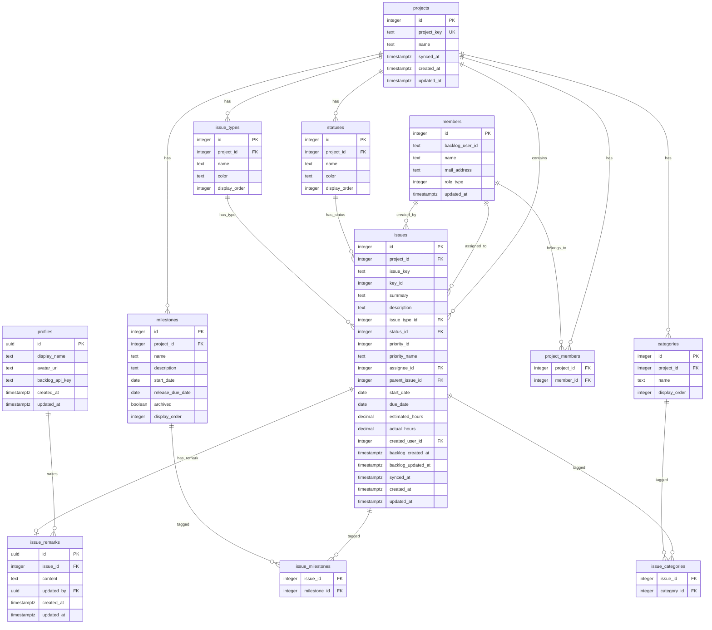

# BackHub データベーススキーマ設計

## 設計方針

- **Backlogデータとアプリ固有データの分離**: Backlog APIから同期されるデータと、BackHub独自データ（備考欄など）を明確に分ける。同期時にアプリ固有データが上書きされるリスクを排除する。
- **Backlog IDをそのまま主キーに使用**: Backlogの数値IDを各テーブルの主キーとして利用。これによりUpsert（同期時の挿入/更新判定）がシンプルになる。
- **プロジェクト単位の設定データを正規化**: ステータス・課題種別・マイルストーン・カテゴリ・メンバーはプロジェクトごとに異なるため、それぞれ独立テーブルに。
- **多対多リレーションのジャンクションテーブル**: 課題-マイルストーン、課題-カテゴリは多対多のため中間テーブルで管理。
- **Supabase Realtimeを意識**: `issues` テーブルと `issue_remarks` テーブルはRealtime対象。

## ER図



## テーブル詳細

### 1. profiles

BackHub認証ユーザー。Supabase Authの `auth.users` テーブルと連携する。

| カラム | 型 | 制約 | 説明 |
|---|---|---|---|
| id | UUID | PK, FK → auth.users | Supabase Auth ユーザーID |
| display_name | TEXT | NOT NULL | 表示名 |
| avatar_url | TEXT | | アバター画像URL |
| backlog_api_key | TEXT | | ユーザーごとのBacklog APIキー（フェーズ5で利用、暗号化推奨） |
| created_at | TIMESTAMPTZ | NOT NULL, DEFAULT now() | |
| updated_at | TIMESTAMPTZ | NOT NULL, DEFAULT now() | |

### 2. projects

Backlogプロジェクト情報のキャッシュ。

| カラム | 型 | 制約 | 説明 |
|---|---|---|---|
| id | INTEGER | PK | Backlog project ID |
| project_key | TEXT | UNIQUE, NOT NULL | プロジェクトキー文字列 |
| name | TEXT | NOT NULL | プロジェクト名 |
| synced_at | TIMESTAMPTZ | | 最終同期日時（差分同期の基準） |
| created_at | TIMESTAMPTZ | NOT NULL, DEFAULT now() | |
| updated_at | TIMESTAMPTZ | NOT NULL, DEFAULT now() | |

### 3. statuses

プロジェクトごとのステータス定義。Backlogではプロジェクト単位でカスタムステータスを設定可能。

| カラム | 型 | 制約 | 説明 |
|---|---|---|---|
| id | INTEGER | PK | Backlog status ID |
| project_id | INTEGER | FK → projects, NOT NULL | |
| name | TEXT | NOT NULL | ステータス名（"未対応", "処理中" 等） |
| color | TEXT | NOT NULL | "#ed8077" 形式。StatusBadgeの色に利用 |
| display_order | INTEGER | NOT NULL | 表示順 |

### 4. issue_types

プロジェクトごとの課題種別。

| カラム | 型 | 制約 | 説明 |
|---|---|---|---|
| id | INTEGER | PK | Backlog issue type ID |
| project_id | INTEGER | FK → projects, NOT NULL | |
| name | TEXT | NOT NULL | 種別名（"バグ", "タスク" 等） |
| color | TEXT | NOT NULL | |
| display_order | INTEGER | NOT NULL | 表示順 |

Backlog APIの `templateSummary`, `templateDescription` は表示不要のため省略。

### 5. milestones

プロジェクトごとのマイルストーン/バージョン。

| カラム | 型 | 制約 | 説明 |
|---|---|---|---|
| id | INTEGER | PK | Backlog version/milestone ID |
| project_id | INTEGER | FK → projects, NOT NULL | |
| name | TEXT | NOT NULL | |
| description | TEXT | | |
| start_date | DATE | | |
| release_due_date | DATE | | |
| archived | BOOLEAN | NOT NULL, DEFAULT false | |
| display_order | INTEGER | NOT NULL | 表示順 |

### 6. categories

プロジェクトごとのカテゴリ。要件定義のMVPフィルターには含まれないが、Backlog課題データに含まれるため格納。

| カラム | 型 | 制約 | 説明 |
|---|---|---|---|
| id | INTEGER | PK | Backlog category ID |
| project_id | INTEGER | FK → projects, NOT NULL | |
| name | TEXT | NOT NULL | |
| display_order | INTEGER | NOT NULL | 表示順 |

### 7. members

Backlogユーザー情報。異なるプロジェクトに同じユーザーが所属し得るため、プロジェクトとは独立して管理。

| カラム | 型 | 制約 | 説明 |
|---|---|---|---|
| id | INTEGER | PK | Backlog user ID |
| backlog_user_id | TEXT | NOT NULL | Backlogのログイン文字列ID ("eguchi" 等) |
| name | TEXT | NOT NULL | 表示名 |
| mail_address | TEXT | | |
| role_type | INTEGER | NOT NULL | 1=Admin, 2=Normal, 3=Reporter, 4=Viewer, 5=GuestReporter, 6=GuestViewer |
| updated_at | TIMESTAMPTZ | NOT NULL, DEFAULT now() | |

### 8. project_members

プロジェクトとメンバーの多対多リレーション。

| カラム | 型 | 制約 | 説明 |
|---|---|---|---|
| project_id | INTEGER | FK → projects, NOT NULL | |
| member_id | INTEGER | FK → members, NOT NULL | |

複合主キー: `(project_id, member_id)`

### 9. issues

Backlog課題データ。アプリケーションのメインテーブル。

| カラム | 型 | 制約 | 説明 |
|---|---|---|---|
| id | INTEGER | PK | Backlog issue ID |
| project_id | INTEGER | FK → projects, NOT NULL | |
| issue_key | TEXT | NOT NULL | "IZUMO_DEV_PHASE3-123" 形式 |
| key_id | INTEGER | NOT NULL | 課題キーの数値部分 |
| summary | TEXT | NOT NULL | 課題タイトル |
| description | TEXT | | 課題詳細 |
| issue_type_id | INTEGER | FK → issue_types, NOT NULL | |
| status_id | INTEGER | FK → statuses, NOT NULL | |
| priority_id | INTEGER | NOT NULL | Backlog優先度ID (2=High, 3=Normal, 4=Low) |
| priority_name | TEXT | NOT NULL | 非正規化（グローバル固定値のため） |
| assignee_id | INTEGER | FK → members | NULL許容（未割り当て） |
| parent_issue_id | INTEGER | FK → issues (self) | NULL許容 |
| start_date | DATE | | |
| due_date | DATE | | |
| estimated_hours | DECIMAL | | |
| actual_hours | DECIMAL | | |
| created_user_id | INTEGER | FK → members, NOT NULL | |
| backlog_created_at | TIMESTAMPTZ | NOT NULL | Backlog上の作成日時 |
| backlog_updated_at | TIMESTAMPTZ | NOT NULL | Backlog上の更新日時 |
| synced_at | TIMESTAMPTZ | NOT NULL, DEFAULT now() | BackHubが最後に同期した日時 |
| created_at | TIMESTAMPTZ | NOT NULL, DEFAULT now() | |
| updated_at | TIMESTAMPTZ | NOT NULL, DEFAULT now() | |

### 10. issue_milestones

課題とマイルストーンの多対多リレーション。Backlog APIの課題レスポンスでは `milestone` が配列。

| カラム | 型 | 制約 | 説明 |
|---|---|---|---|
| issue_id | INTEGER | FK → issues, NOT NULL | |
| milestone_id | INTEGER | FK → milestones, NOT NULL | |

複合主キー: `(issue_id, milestone_id)`

### 11. issue_categories

課題とカテゴリの多対多リレーション。Backlog APIの課題レスポンスでは `category` が配列。

| カラム | 型 | 制約 | 説明 |
|---|---|---|---|
| issue_id | INTEGER | FK → issues, NOT NULL | |
| category_id | INTEGER | FK → categories, NOT NULL | |

複合主キー: `(issue_id, category_id)`

### 12. issue_remarks

BackHub固有の備考欄。Backlogには存在しないBackHub独自フィールド。同期処理では一切触れないため、ユーザーが入力したデータが上書きされることはない。

| カラム | 型 | 制約 | 説明 |
|---|---|---|---|
| id | UUID | PK, DEFAULT gen_random_uuid() | |
| issue_id | INTEGER | FK → issues, UNIQUE, NOT NULL | 1課題につき1つ |
| content | TEXT | NOT NULL, DEFAULT '' | 備考テキスト |
| updated_by | UUID | FK → profiles | 最終編集者 |
| created_at | TIMESTAMPTZ | NOT NULL, DEFAULT now() | |
| updated_at | TIMESTAMPTZ | NOT NULL, DEFAULT now() | |

## インデックス

| テーブル | カラム | 種類 | 用途 |
|---|---|---|---|
| issues | project_id | B-tree | プロジェクト別の課題一覧取得 |
| issues | status_id | B-tree | ステータスフィルター |
| issues | assignee_id | B-tree | 担当者フィルター |
| issues | issue_key | UNIQUE | 課題キーによる一意検索 |
| issues | backlog_updated_at | B-tree | 更新日ソート・差分同期 |
| project_members | project_id | B-tree | 複合PKで自動作成 |
| project_members | member_id | B-tree | 複合PKで自動作成 |
| issue_milestones | issue_id | B-tree | 複合PKで自動作成 |
| issue_milestones | milestone_id | B-tree | マイルストーンフィルター |
| issue_categories | issue_id | B-tree | 複合PKで自動作成 |
| issue_categories | category_id | B-tree | カテゴリフィルター |
| issue_remarks | issue_id | UNIQUE | 課題ごとの備考取得（1:1） |

## RLS (Row Level Security) 方針

社内ツールのため基本的には緩い設定。

| テーブル | SELECT | INSERT | UPDATE | DELETE |
|---|---|---|---|---|
| profiles | 認証済み | 自分のみ | 自分のみ | - |
| projects | 認証済み | service_role | service_role | service_role |
| statuses | 認証済み | service_role | service_role | service_role |
| issue_types | 認証済み | service_role | service_role | service_role |
| milestones | 認証済み | service_role | service_role | service_role |
| categories | 認証済み | service_role | service_role | service_role |
| members | 認証済み | service_role | service_role | service_role |
| project_members | 認証済み | service_role | service_role | service_role |
| issues | 認証済み | service_role | service_role | service_role |
| issue_milestones | 認証済み | service_role | service_role | service_role |
| issue_categories | 認証済み | service_role | service_role | service_role |
| issue_remarks | 認証済み | 認証済み | 認証済み | - |

- `service_role`: Next.js API Route (BFF) からのみ操作可能（Supabase サービスロールキー使用）
- 認証済み: Supabase Auth でログイン済みの全ユーザー

## Supabase Realtime

以下のテーブルでRealtimeを有効化:

- **issues** - Webhook経由の課題更新を即座にフロントに反映
- **issue_remarks** - 備考欄の編集を他ユーザーにも即時反映

## DDL

```sql
-- ============================================================
-- profiles: BackHub認証ユーザー
-- ============================================================
CREATE TABLE profiles (
  id          UUID PRIMARY KEY REFERENCES auth.users ON DELETE CASCADE,
  display_name TEXT NOT NULL,
  avatar_url  TEXT,
  backlog_api_key TEXT,
  created_at  TIMESTAMPTZ NOT NULL DEFAULT now(),
  updated_at  TIMESTAMPTZ NOT NULL DEFAULT now()
);

ALTER TABLE profiles ENABLE ROW LEVEL SECURITY;
CREATE POLICY "profiles_select" ON profiles FOR SELECT TO authenticated USING (true);
CREATE POLICY "profiles_insert" ON profiles FOR INSERT TO authenticated WITH CHECK (auth.uid() = id);
CREATE POLICY "profiles_update" ON profiles FOR UPDATE TO authenticated USING (auth.uid() = id);

-- ============================================================
-- projects: Backlogプロジェクト
-- ============================================================
CREATE TABLE projects (
  id          INTEGER PRIMARY KEY,
  project_key TEXT NOT NULL UNIQUE,
  name        TEXT NOT NULL,
  synced_at   TIMESTAMPTZ,
  created_at  TIMESTAMPTZ NOT NULL DEFAULT now(),
  updated_at  TIMESTAMPTZ NOT NULL DEFAULT now()
);

ALTER TABLE projects ENABLE ROW LEVEL SECURITY;
CREATE POLICY "projects_select" ON projects FOR SELECT TO authenticated USING (true);

-- ============================================================
-- statuses: プロジェクトごとのステータス
-- ============================================================
CREATE TABLE statuses (
  id            INTEGER PRIMARY KEY,
  project_id    INTEGER NOT NULL REFERENCES projects ON DELETE CASCADE,
  name          TEXT NOT NULL,
  color         TEXT NOT NULL,
  display_order INTEGER NOT NULL
);

ALTER TABLE statuses ENABLE ROW LEVEL SECURITY;
CREATE POLICY "statuses_select" ON statuses FOR SELECT TO authenticated USING (true);

-- ============================================================
-- issue_types: プロジェクトごとの課題種別
-- ============================================================
CREATE TABLE issue_types (
  id            INTEGER PRIMARY KEY,
  project_id    INTEGER NOT NULL REFERENCES projects ON DELETE CASCADE,
  name          TEXT NOT NULL,
  color         TEXT NOT NULL,
  display_order INTEGER NOT NULL
);

ALTER TABLE issue_types ENABLE ROW LEVEL SECURITY;
CREATE POLICY "issue_types_select" ON issue_types FOR SELECT TO authenticated USING (true);

-- ============================================================
-- milestones: プロジェクトごとのマイルストーン
-- ============================================================
CREATE TABLE milestones (
  id               INTEGER PRIMARY KEY,
  project_id       INTEGER NOT NULL REFERENCES projects ON DELETE CASCADE,
  name             TEXT NOT NULL,
  description      TEXT,
  start_date       DATE,
  release_due_date DATE,
  archived         BOOLEAN NOT NULL DEFAULT false,
  display_order    INTEGER NOT NULL
);

ALTER TABLE milestones ENABLE ROW LEVEL SECURITY;
CREATE POLICY "milestones_select" ON milestones FOR SELECT TO authenticated USING (true);

-- ============================================================
-- categories: プロジェクトごとのカテゴリ
-- ============================================================
CREATE TABLE categories (
  id            INTEGER PRIMARY KEY,
  project_id    INTEGER NOT NULL REFERENCES projects ON DELETE CASCADE,
  name          TEXT NOT NULL,
  display_order INTEGER NOT NULL
);

ALTER TABLE categories ENABLE ROW LEVEL SECURITY;
CREATE POLICY "categories_select" ON categories FOR SELECT TO authenticated USING (true);

-- ============================================================
-- members: Backlogユーザー
-- ============================================================
CREATE TABLE members (
  id              INTEGER PRIMARY KEY,
  backlog_user_id TEXT NOT NULL,
  name            TEXT NOT NULL,
  mail_address    TEXT,
  role_type       INTEGER NOT NULL,
  updated_at      TIMESTAMPTZ NOT NULL DEFAULT now()
);

ALTER TABLE members ENABLE ROW LEVEL SECURITY;
CREATE POLICY "members_select" ON members FOR SELECT TO authenticated USING (true);

-- ============================================================
-- project_members: プロジェクト-メンバー中間テーブル
-- ============================================================
CREATE TABLE project_members (
  project_id INTEGER NOT NULL REFERENCES projects ON DELETE CASCADE,
  member_id  INTEGER NOT NULL REFERENCES members ON DELETE CASCADE,
  PRIMARY KEY (project_id, member_id)
);

ALTER TABLE project_members ENABLE ROW LEVEL SECURITY;
CREATE POLICY "project_members_select" ON project_members FOR SELECT TO authenticated USING (true);

-- ============================================================
-- issues: Backlog課題
-- ============================================================
CREATE TABLE issues (
  id                 INTEGER PRIMARY KEY,
  project_id         INTEGER NOT NULL REFERENCES projects ON DELETE CASCADE,
  issue_key          TEXT NOT NULL UNIQUE,
  key_id             INTEGER NOT NULL,
  summary            TEXT NOT NULL,
  description        TEXT,
  issue_type_id      INTEGER NOT NULL REFERENCES issue_types ON DELETE RESTRICT,
  status_id          INTEGER NOT NULL REFERENCES statuses ON DELETE RESTRICT,
  priority_id        INTEGER NOT NULL,
  priority_name      TEXT NOT NULL,
  assignee_id        INTEGER REFERENCES members ON DELETE SET NULL,
  parent_issue_id    INTEGER REFERENCES issues ON DELETE SET NULL,
  start_date         DATE,
  due_date           DATE,
  estimated_hours    DECIMAL,
  actual_hours       DECIMAL,
  created_user_id    INTEGER NOT NULL REFERENCES members ON DELETE RESTRICT,
  backlog_created_at TIMESTAMPTZ NOT NULL,
  backlog_updated_at TIMESTAMPTZ NOT NULL,
  synced_at          TIMESTAMPTZ NOT NULL DEFAULT now(),
  created_at         TIMESTAMPTZ NOT NULL DEFAULT now(),
  updated_at         TIMESTAMPTZ NOT NULL DEFAULT now()
);

CREATE INDEX idx_issues_project_id ON issues (project_id);
CREATE INDEX idx_issues_status_id ON issues (status_id);
CREATE INDEX idx_issues_assignee_id ON issues (assignee_id);
CREATE INDEX idx_issues_backlog_updated_at ON issues (backlog_updated_at);

ALTER TABLE issues ENABLE ROW LEVEL SECURITY;
CREATE POLICY "issues_select" ON issues FOR SELECT TO authenticated USING (true);

-- ============================================================
-- issue_milestones: 課題-マイルストーン中間テーブル
-- ============================================================
CREATE TABLE issue_milestones (
  issue_id     INTEGER NOT NULL REFERENCES issues ON DELETE CASCADE,
  milestone_id INTEGER NOT NULL REFERENCES milestones ON DELETE CASCADE,
  PRIMARY KEY (issue_id, milestone_id)
);

CREATE INDEX idx_issue_milestones_milestone_id ON issue_milestones (milestone_id);

ALTER TABLE issue_milestones ENABLE ROW LEVEL SECURITY;
CREATE POLICY "issue_milestones_select" ON issue_milestones FOR SELECT TO authenticated USING (true);

-- ============================================================
-- issue_categories: 課題-カテゴリ中間テーブル
-- ============================================================
CREATE TABLE issue_categories (
  issue_id    INTEGER NOT NULL REFERENCES issues ON DELETE CASCADE,
  category_id INTEGER NOT NULL REFERENCES categories ON DELETE CASCADE,
  PRIMARY KEY (issue_id, category_id)
);

CREATE INDEX idx_issue_categories_category_id ON issue_categories (category_id);

ALTER TABLE issue_categories ENABLE ROW LEVEL SECURITY;
CREATE POLICY "issue_categories_select" ON issue_categories FOR SELECT TO authenticated USING (true);

-- ============================================================
-- issue_remarks: BackHub固有の備考欄
-- ============================================================
CREATE TABLE issue_remarks (
  id         UUID PRIMARY KEY DEFAULT gen_random_uuid(),
  issue_id   INTEGER NOT NULL UNIQUE REFERENCES issues ON DELETE CASCADE,
  content    TEXT NOT NULL DEFAULT '',
  updated_by UUID REFERENCES profiles ON DELETE SET NULL,
  created_at TIMESTAMPTZ NOT NULL DEFAULT now(),
  updated_at TIMESTAMPTZ NOT NULL DEFAULT now()
);

ALTER TABLE issue_remarks ENABLE ROW LEVEL SECURITY;
CREATE POLICY "issue_remarks_select" ON issue_remarks FOR SELECT TO authenticated USING (true);
CREATE POLICY "issue_remarks_insert" ON issue_remarks FOR INSERT TO authenticated WITH CHECK (true);
CREATE POLICY "issue_remarks_update" ON issue_remarks FOR UPDATE TO authenticated USING (true);

-- ============================================================
-- Realtime 有効化
-- ============================================================
ALTER PUBLICATION supabase_realtime ADD TABLE issues;
ALTER PUBLICATION supabase_realtime ADD TABLE issue_remarks;

-- ============================================================
-- updated_at 自動更新トリガー
-- ============================================================
CREATE OR REPLACE FUNCTION update_updated_at()
RETURNS TRIGGER AS $$
BEGIN
  NEW.updated_at = now();
  RETURN NEW;
END;
$$ LANGUAGE plpgsql;

CREATE TRIGGER trg_profiles_updated_at
  BEFORE UPDATE ON profiles FOR EACH ROW EXECUTE FUNCTION update_updated_at();

CREATE TRIGGER trg_projects_updated_at
  BEFORE UPDATE ON projects FOR EACH ROW EXECUTE FUNCTION update_updated_at();

CREATE TRIGGER trg_issues_updated_at
  BEFORE UPDATE ON issues FOR EACH ROW EXECUTE FUNCTION update_updated_at();

CREATE TRIGGER trg_issue_remarks_updated_at
  BEFORE UPDATE ON issue_remarks FOR EACH ROW EXECUTE FUNCTION update_updated_at();
```
